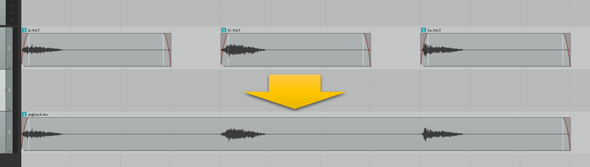

# ATrack

Combine pieces of audio into one large audio data on browser!



## How to use

1. Build `src/ATrack.ts` with `tsc`
2. Include generated `ATrack.js` into your index.html.

```ts
async function generateTrackAndPlay() {

  const channels = 2
  const sampleRate = 44100
  const audioLength = 10 // seconds

  // Create instance
  const at = new ATrack(channels, sampleRate, audioLength)

  // Put audio
  await at.put('path/to/some_audio.ogg', 0)   // play some_audio.ogg at start position in track
  await at.put('path/to/some_audio.ogg', 1)   // play some_audio.ogg at 1 second position in track
  await at.put('path/to/some_audio.ogg', 2.5) // play some_audio.ogg at 2.5 seconds position in track

  // Or, put some audio at once
  await at.putAll([
    { url: 'path/to/sound1.ogg', time: 5 },
    { url: 'path/to/sound2.ogg', time: 5.1 },
    { url: 'path/to/sound3.ogg', time: 5.2 },
    { url: 'path/to/sound4.ogg', time: 5.3 },
    { url: 'path/to/sound5.ogg', time: 5.4 })

  // Create audio data
  const renderedBuffer: AudioBuffer = await at.render()

  // Play it (with normal WebAudio API)
  const audioContext = new AudioContext()
  const song = audioContext.createBufferSource()
  song.buffer = renderedBuffer
  song.connect(audioContext.destination)
  song.start()
}
```
